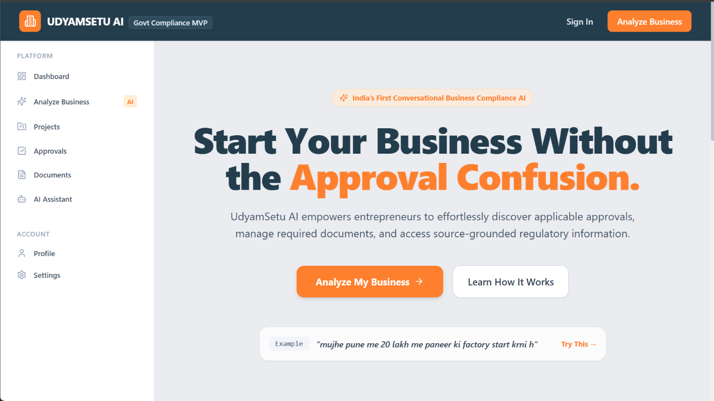
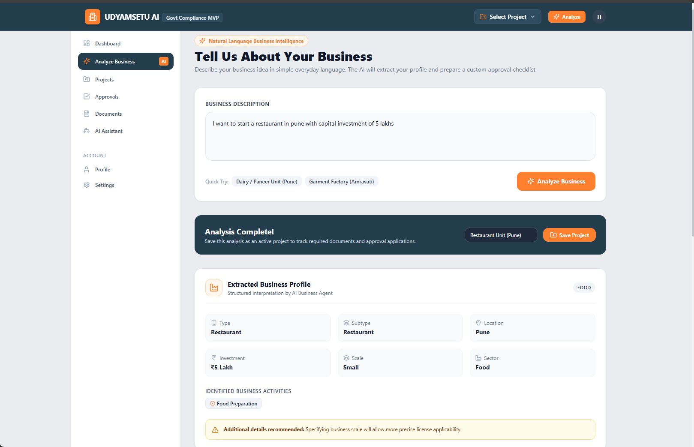
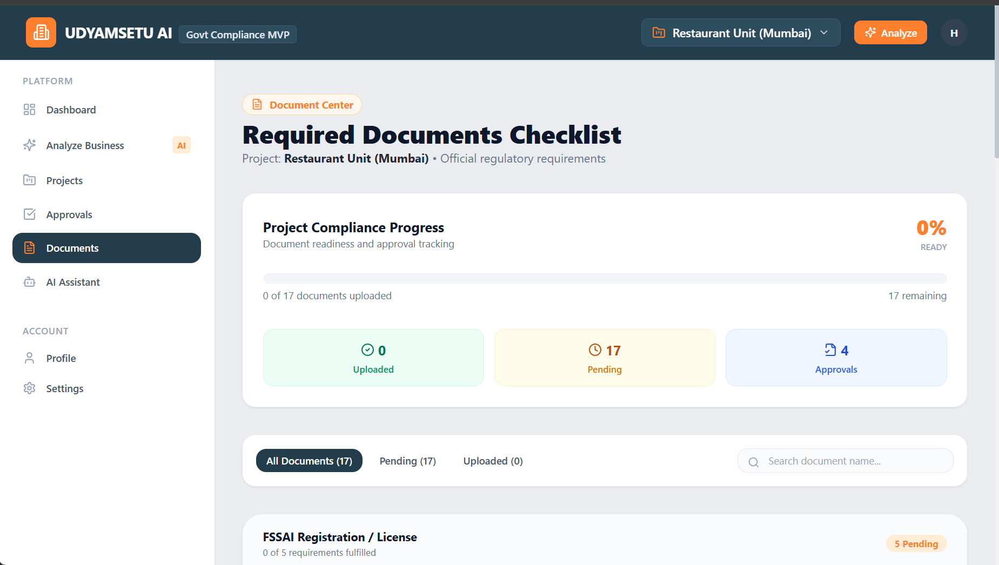
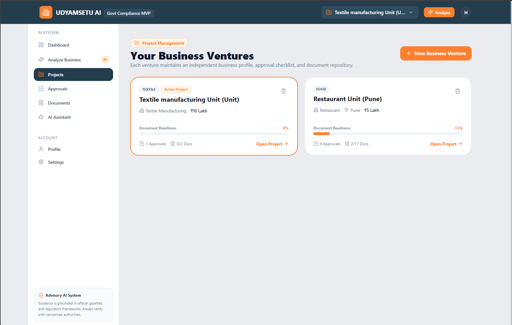

# 🚀 UdyamSetu AI

## AI-Powered Business Approval & Compliance Assistant

> **From Business Idea → Relevant Approvals → Clear Next Steps**

**Smart India Hackathon 2026**
**Team:** `Tech Titans_01`

---

<p align="center">

### 🏛️ Simplifying the Business Approval Journey with AI

**Discover • Understand • Navigate • Act**

</p>

---

## 🔗 Quick Links

| Resource         | Link                     |
| ---------------- | ------------------------ |
| 🚀 Live Demo     | `ADD LIVE DEMO LINK`     |
| 🎥 Demo Video    | `ADD DEMO VIDEO LINK`    |
| 📊 Presentation  | `ADD PPT LINK`           |
| 📄 Documentation | `ADD DOCUMENTATION LINK` |
| 💻 GitHub        | `ADD REPOSITORY LINK`    |

---

# 🎯 At a Glance

Starting and operating a business can require entrepreneurs to deal with multiple registrations, permissions, licences, NOCs, inspections, renewals, documentation requirements and government schemes.

The information required to complete these processes can be distributed across different departments, portals and documents.

### 💡 UdyamSetu AI

UdyamSetu is an **AI-powered business assistance platform** that helps entrepreneurs understand their potential approval, documentation, compliance and support requirements through a unified interface.

Instead of manually searching across multiple sources, users can describe their business context and interact with an AI assistant to discover relevant information and understand their **next steps**.

---

# 🧩 The Problem

Entrepreneurs may need different approvals depending on:

* 🏢 Type of business
* 📍 Location
* 🏭 Industry / sector
* 💰 Project size
* 📝 Nature of business activity
* 🚀 Stage of operation
* ⚖️ Applicable regulations

This creates a fragmented journey:

```text
Multiple Departments
        ↓
Multiple Portals
        ↓
Scattered Information
        ↓
Complex Requirements
        ↓
Documentation Confusion
        ↓
Missed Queries / Renewals
        ↓
Delayed Business Setup
```

### The core challenge

> **Entrepreneurs need a simpler way to discover and understand the approvals, documents, schemes and next actions relevant to their business.**

---

# 💡 Our Solution

UdyamSetu acts as an **intelligent assistance and discovery layer** between entrepreneurs and the information they need.

```text
                    👤 ENTREPRENEUR
                          │
                          ▼
                 ┌─────────────────┐
                 │   UDYAMSETU AI  │
                 └────────┬────────┘
                          │
          ┌───────────────┼───────────────┐
          ▼               ▼               ▼
      Approval          AI              Scheme
      Discovery      Assistant         Discovery
          │               │               │
          └───────────────┼───────────────┘
                          ▼
                ┌───────────────────┐
                │ Relevant Guidance │
                │ + Requirements    │
                │ + Next Steps      │
                └───────────────────┘
```

### Our approach

**Business Context → AI Understanding → Relevant Information → Actionable Guidance**

---

# ⭐ Key Features

## 🤖 1. AI Business Assistant

Users can communicate with UdyamSetu using natural language.

For example:

> **"I want to start a food processing business in Maharashtra. What approvals might I need?"**

The AI can help organize potentially relevant information such as:

* Approvals
* Registrations
* Documents
* Authorities
* Requirements
* Schemes
* Next steps

---

# 🧭 2. Approval Discovery

UdyamSetu helps entrepreneurs identify potentially relevant approvals based on their business context.

Instead of manually searching through multiple portals:

```text
Business Details
      ↓
Business Context
      ↓
Approval Identification
      ↓
Requirement Information
      ↓
Next Steps
```

---

# 📄 3. Document & Requirement Guidance

Understanding documentation can be difficult for first-time entrepreneurs.

UdyamSetu presents requirements in a structured format:

```text
Approval
   ↓
Eligibility
   ↓
Required Documents
   ↓
Concerned Authority
   ↓
Application Process
   ↓
Next Step
```

This helps users understand **what information they may need before proceeding**.

---

# 🏛️ 4. Government Scheme Discovery

Entrepreneurs may be eligible for different government schemes and support programs depending on their business context.

UdyamSetu aims to make scheme discovery easier by helping users find potentially relevant opportunities based on their business information.

---

# 💬 5. Conversational Interface

Users don't need to know technical government terminology.

They can ask questions naturally:

```text
"What registrations do I need?"

"What documents are required?"

"Which approval should I look at first?"

"Do I need an NOC?"

"What government schemes may apply to me?"

"What should I do next?"
```

---

# 📊 6. Personalized Dashboard

The dashboard provides a centralized view of the entrepreneur's business journey.

It can include:

* 👤 Business profile
* 🏛️ Relevant approvals
* 📋 Requirements
* 📄 Documents
* ⏳ Pending actions
* 🔔 Important updates
* 🎯 Recommended next steps
* 💰 Relevant schemes

---

# 🔥 What Makes UdyamSetu Different?

## Traditional Approach

```text
Search Online
     ↓
Open Multiple Portals
     ↓
Read Documents
     ↓
Identify Department
     ↓
Understand Eligibility
     ↓
Find Documents
     ↓
Repeat for Every Approval
```

## UdyamSetu Approach

```text
              ONE PLATFORM
                   ↓
           BUSINESS CONTEXT
                   ↓
              AI ASSISTANCE
                   ↓
        RELEVANT INFORMATION
                   ↓
             CLEAR GUIDANCE
                   ↓
          OFFICIAL PROCESS
```

### Our key principle

> **UdyamSetu does not aim to replace government portals. It simplifies the discovery and understanding layer before users proceed to the relevant official process.**

---

# 🧠 AI Architecture

```text
                         USER
                           │
                           ▼
                ┌────────────────────┐
                │   Next.js Frontend │
                │   React + TypeScript│
                └─────────┬──────────┘
                          │
                       REST API
                          │
                          ▼
                ┌────────────────────┐
                │   FastAPI Backend  │
                └─────────┬──────────┘
                          │
             ┌────────────┼────────────┐
             │            │            │
             ▼            ▼            ▼
       Business Data   AI Engine    Database
             │            │            │
             └────────────┼────────────┘
                          │
                          ▼
                ┌────────────────────┐
                │ Structured AI      │
                │ Response           │
                └─────────┬──────────┘
                          │
                          ▼
                         USER
```

---

# 🏗️ Technical Architecture

```text
┌─────────────────────────────────────────────────────────┐
│                    UDYAMSETU AI                         │
└─────────────────────────────────────────────────────────┘

                         USER
                           │
                           ▼
┌─────────────────────────────────────────────────────────┐
│                    FRONTEND LAYER                       │
│                                                         │
│       Next.js + React + TypeScript + Tailwind CSS      │
│                                                         │
│  Dashboard │ AI Assistant │ Approvals │ Schemes       │
└────────────────────────┬────────────────────────────────┘
                         │
                         │ REST API
                         ▼
┌─────────────────────────────────────────────────────────┐
│                    BACKEND LAYER                        │
│                                                         │
│                       FastAPI                           │
│                                                         │
│  Authentication │ Business Logic │ API Routes          │
└────────────────────────┬────────────────────────────────┘
                         │
             ┌───────────┼────────────┐
             │           │            │
             ▼           ▼            ▼
┌────────────────┐ ┌────────────┐ ┌────────────────┐
│ Business Data  │ │ AI Engine  │ │   Database     │
│                │ │            │ │                │
│ Approvals      │ │ Gemma/LLM  │ │ User Data      │
│ Requirements   │ │ Context    │ │ Business Data  │
│ Schemes        │ │ Reasoning  │ │ Application    │
└────────────────┘ └────────────┘ └────────────────┘
             │           │            │
             └───────────┼────────────┘
                         ▼
                ┌──────────────────┐
                │ Actionable       │
                │ Guidance         │
                └──────────────────┘
```

---

# 🛠️ Technology Stack

## Frontend

* **Next.js**
* **React**
* **TypeScript**
* **Tailwind CSS**
* Responsive UI

## Backend

* **Python**
* **FastAPI**
* REST APIs

## AI

* **Gemma / LLM**
* Context-aware prompting
* Natural language interaction
* AI-assisted business guidance

## Database

* **PostgreSQL**
* Structured business data
* User/business information

## Development

* Git
* GitHub
* VS Code
* REST APIs

---

# 🔄 User Journey

### 1️⃣ Business Profile

The user enters relevant business information.

```text
Business Type
      +
Location
      +
Sector
      +
Business Stage
      +
Project Details
```

↓

### 2️⃣ Context Processing

UdyamSetu processes the business context.

↓

### 3️⃣ AI Assistance

The entrepreneur can ask questions naturally.

↓

### 4️⃣ Approval Discovery

Potentially relevant approvals and requirements are presented.

↓

### 5️⃣ Guidance

The platform explains the information in a simplified manner.

↓

### 6️⃣ Action

The entrepreneur is guided toward the relevant next step and, where applicable, the official process.

---

# 🧪 MVP

The current MVP demonstrates the core UdyamSetu concept.

### ✅ Core MVP Capabilities

* [x] AI-powered business assistant
* [x] Business-context-based interaction
* [x] Approval guidance
* [x] Requirement/document guidance
* [x] Government scheme discovery concept
* [x] Personalized business dashboard
* [x] Frontend + backend integration
* [x] REST API architecture
* [x] AI integration
* [x] Responsive web interface

---

# 🚧 Future Scope

UdyamSetu can be extended with:

### 🔌 Official Integrations

* Government APIs
* Official portal integrations
* Real-time application status

### 🔔 Smart Notifications

* Renewal reminders
* Pending actions
* Application updates
* Important deadlines

### 📄 Intelligent Documents

* Automated document checklists
* Document validation
* Smart form assistance

### 🌐 Accessibility

* Multilingual support
* Voice-based interaction
* Regional language assistance

### 📊 Advanced Dashboard

* Compliance calendar
* Approval timeline
* Business progress tracking
* Personalized recommendations

### 🤝 Ecosystem Integration

* Government services
* Incubators
* MSME support organizations
* Financial assistance programs

---

# 🔐 Responsible AI

UdyamSetu is designed as an **assistance and discovery platform**, not as a replacement for official government authorities.

### Important principles

* Official government sources remain authoritative.
* AI-generated information should be verified before official submission.
* The platform should clearly distinguish guidance from confirmed requirements.
* User information should be handled securely.
* Official portals remain the destination for actual applications wherever applicable.
* The system should avoid presenting uncertain information as guaranteed requirements.

---

# 📈 Expected Impact

## ⏱️ Save Time

Reduce repetitive searching across multiple sources.

## 🧠 Improve Understanding

Translate complex information into simpler, contextual guidance.

## 📋 Reduce Confusion

Help entrepreneurs understand potentially required documents and processes.

## 🧭 Better Navigation

Help users identify the relevant department, approval or next step.

## 🚀 Support Entrepreneurship

Make the early compliance and approval discovery process more approachable.

---

# 📸 Screenshots

Add your actual screenshots to the `/screenshots` folder.

### 🏠 Dashboard



### 🤖 AI Business Assistant



### 🏛️ Approval Discovery



### 📊 Business Profile / Journey



---

# 🎥 Demo

## 🚀 Live Demo

**[Open UdyamSetu AI →](ADD_LIVE_DEMO_LINK)**

## 🎬 Demo Video

**[Watch Project Demo →](ADD_DEMO_VIDEO_LINK)**

The demo should demonstrate:

```text
1. User Registration / Login
        ↓
2. Business Profile
        ↓
3. AI Business Assistant
        ↓
4. Approval Discovery
        ↓
5. Requirement Guidance
        ↓
6. Scheme Discovery
        ↓
7. Dashboard
```

---

# 📁 Project Structure

```text
UdyamSetu/
│
├── frontend/
│   │
│   ├── app/
│   ├── components/
│   ├── public/
│   ├── styles/
│   ├── package.json
│   └── ...
│
├── backend/
│   │
│   ├── main.py
│   ├── routes/
│   ├── services/
│   ├── models/
│   ├── requirements.txt
│   └── ...
│
├── data/
│   └── ...
│
├── screenshots/
│   ├── dashboard.png
│   ├── ai-assistant.png
│   ├── approvals.png
│   └── business-profile.png
│
├── docs/
│   ├── architecture.png
│   ├── workflow.png
│   └── technical-approach.png
│
├── .gitignore
├── README.md
└── LICENSE
```

> Update the structure above to match the final repository before submission.

---

# ⚙️ Installation & Setup

## Prerequisites

Make sure the following are installed:

* Node.js
* npm
* Python 3.10+
* Git
* PostgreSQL (if required by the configured backend)

---

## 1️⃣ Clone Repository

```bash
git clone https://github.com/YOUR-USERNAME/udyamsetu.git

cd udyamsetu
```

---

# 2️⃣ Frontend Setup

```bash
cd frontend

npm install

npm run dev
```

Frontend:

```text
http://localhost:3000
```

---

# 3️⃣ Backend Setup

Open a new terminal:

```bash
cd backend
```

Create a virtual environment:

### Windows

```bash
python -m venv venv

venv\Scripts\activate
```

### Linux / macOS

```bash
python3 -m venv venv

source venv/bin/activate
```

Install dependencies:

```bash
pip install -r requirements.txt
```

Run FastAPI:

```bash
uvicorn main:app --reload
```

Backend:

```text
http://localhost:8000
```

API documentation:

```text
http://localhost:8000/docs
```

---

# 🔑 Environment Variables

Create a `.env` file according to the project's configuration.

Example:

```env
AI_API_KEY=your_api_key
DATABASE_URL=your_database_url
```

### ⚠️ Security

Never commit:

```text
API Keys
Passwords
Database Credentials
Secret Tokens
.env files
```

Add them to `.gitignore`.

---

# 🗃️ Data & Information Sources

UdyamSetu should use authoritative sources wherever possible.

Potential sources include:

* Central Government portals
* State Government portals
* Ministry websites
* Government departments
* Official scheme documentation
* Official regulatory notifications
* Public government datasets/APIs

### Data principle

> **The AI layer assists users in understanding information; authoritative government sources remain the source of truth for official requirements.**

The final implementation should document the exact sources used by the MVP.

---

# 🧪 Example AI Interaction

### User

> I want to start a small food processing business in Maharashtra. What should I check before starting?

### UdyamSetu

The system can organize the response into:

```text
🏢 Business Category
        ↓
📋 Potential Registrations
        ↓
🏛️ Relevant Authorities
        ↓
📄 Possible Documents
        ↓
💰 Relevant Schemes
        ↓
🧭 Suggested Next Steps
```

The user can then ask follow-up questions.

---

# 🗺️ Roadmap

```text
                         UDYAMSETU
                            │
                            ▼
                     ┌─────────────┐
                     │     MVP     │
                     │ AI + UI +   │
                     │ Dashboard   │
                     └──────┬──────┘
                            │
                            ▼
                  Official Data/API
                     Integration
                            │
                            ▼
                    Approval Tracking
                            │
                            ▼
                  Smart Notifications
                            │
                            ▼
                    Scheme Matching
                            │
                            ▼
                   Multilingual AI
                            │
                            ▼
                  Voice-Based Access
                            │
                            ▼
                Complete Compliance
                       Assistant
```

---

# 👥 Team — Tech Titans_01

## 🏆 Smart India Hackathon 2026

|  # | Team Member      |
| -: | ---------------- |
| 01 | **Aayush Singh** |
| 02 | **Bhagyesh**     |
| 03 | **Saurabh**      |
| 04 | **Kirshna**      |
| 05 | **Disha**        |
| 06 | **Pranali**      |

### Team Philosophy

> **Research together. Build together. Test together. Present together.**

Tech Titans_01 combines development, AI, research, UI/UX, documentation and problem-solving to build UdyamSetu AI.

---

# 🏆 Smart India Hackathon 2026

### Project

**UdyamSetu AI**

### Team

**Tech Titans_01**

### Focus

**Simplifying the discovery and understanding of business approvals, requirements and government support through AI.**

---

# 🤝 Contribution

Contributions and suggestions are welcome.

Create a feature branch:

```bash
git checkout -b feature/your-feature
```

Make changes:

```bash
git add .
```

Commit:

```bash
git commit -m "Add: your feature"
```

Push:

```bash
git push origin feature/your-feature
```

Then open a Pull Request.

---

# 📄 License

This project has been developed by **Tech Titans_01** for **Smart India Hackathon 2026**.

If the repository is intended for open-source reuse, add the appropriate license.

---

# 🌟 Our Vision

UdyamSetu is built around a simple idea:

> ### **Entrepreneurs should spend more time building their businesses and less time figuring out where to start.**

```text
                  BUSINESS IDEA
                       │
                       ▼
                ┌──────────────┐
                │  UDYAMSETU   │
                │      AI      │
                └──────┬───────┘
                       │
            ┌──────────┼──────────┐
            ▼          ▼          ▼
       APPROVALS   DOCUMENTS   SCHEMES
            │          │          │
            └──────────┼──────────┘
                       ▼
                 CLEAR GUIDANCE
                       │
                       ▼
                 NEXT ACTION
                       │
                       ▼
              OFFICIAL PROCESS
```

---

<p align="center">

# 🚀 UdyamSetu AI

### **Understand. Navigate. Build.**

**Built by Team Tech Titans_01 🇮🇳**

**Smart India Hackathon 2026**

</p>
